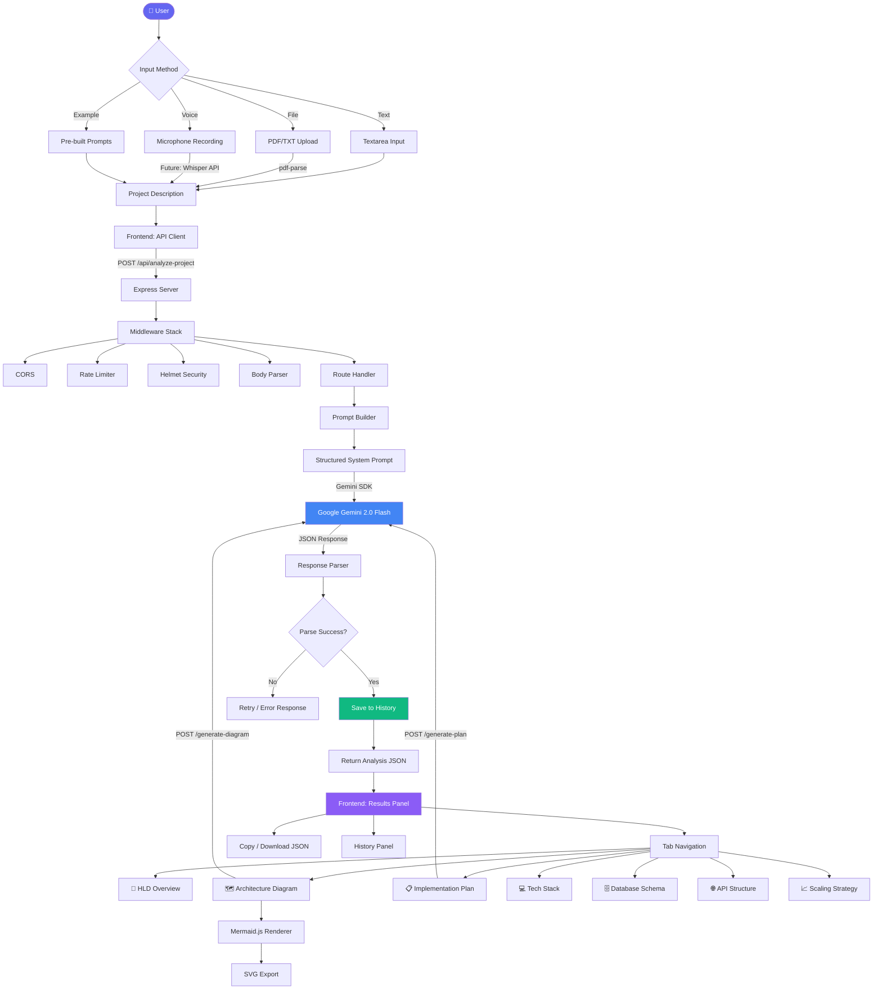

# 🏗️ ArchGen AI — AI-Powered Architecture Generator

<div align="center">


**Transform your project ideas into production-ready system architectures in seconds.**

ArchGen AI is a full-stack SaaS-style web application that leverages Google's Gemini AI to automatically generate High-Level Designs, architecture diagrams, implementation plans, tech stack recommendations, database schemas, API structures, and scaling strategies — all from a single project description.

[Features](#-features) · [Tech Stack](#-tech-stack) · [Architecture](#-high-level-design-hld) · [Setup](#-getting-started) · [API Docs](#-api-reference) · [Screenshots](#-screenshots)

</div>

---

## 📋 Table of Contents

- [Features](#-features)
- [Tech Stack](#-tech-stack)
- [High-Level Design (HLD)](#-high-level-design-hld)
- [System Architecture Flowchart](#-system-architecture-flowchart)
- [Application Flow](#-application-flow)
- [Project Structure](#-project-structure)
- [Getting Started](#-getting-started)
- [Environment Variables](#-environment-variables)
- [API Reference](#-api-reference)
- [Database Schema](#-database-schema)
- [AI Prompt Engineering](#-ai-prompt-engineering)
- [Screenshots](#-screenshots)
- [Security](#-security)
- [Performance & Optimization](#-performance--optimization)
- [Contributing](#-contributing)
- [License](#-license)

---

## ✨ Features

### Core AI-Powered Features
| Feature | Description |
|---------|-------------|
| 🧠 **HLD Generation** | Complete high-level design with actors, components, data flow, and key architectural decisions |
| 🗺️ **Architecture Diagrams** | Visual Mermaid.js diagrams auto-generated from system analysis, rendered in-browser |
| 📋 **Implementation Roadmap** | 5-phase step-by-step development plan with tasks, priorities, durations, and milestones |
| 💻 **Tech Stack Suggestions** | AI-recommended technologies (frontend, backend, DB, infra, DevOps) with justifications |
| 🗄️ **Database Schema** | Table definitions with field types, constraints, and relationships |
| 🌐 **API Structure** | REST endpoint design with methods, paths, request/response bodies |
| 📈 **Scaling Strategy** | Horizontal, vertical, caching, and performance optimization recommendations |

### UX & Product Features
| Feature | Description |
|---------|-------------|
| 📁 **File Upload** | Drag-and-drop PDF, TXT, or Markdown files as project input |
| 🎙️ **Voice Input** | Record voice descriptions using browser microphone |
| 📜 **History** | All generations saved locally — click to reload any past architecture |
| 📤 **Export** | Download full architecture as JSON or diagram as SVG |
| 📋 **Copy Buttons** | One-click copy for every section (JSON, schema, cURL commands) |
| 🌙 **Dark/Light Mode** | Persistent theme toggle with smooth transitions |
| 💡 **Example Prompts** | 5 pre-built project ideas to try instantly |
| ⏳ **Skeleton Loaders** | Polished loading states with shimmer animations |
| 📱 **Responsive Design** | Fully adaptive layout for desktop, tablet, and mobile |

---

## 🛠️ Tech Stack

### Frontend
| Technology | Purpose | Version |
|-----------|---------|---------|
| **Next.js** | React framework with App Router, SSR, Turbopack | 16.x |
| **TypeScript** | Type-safe development | 5.x |
| **Tailwind CSS** | Utility-first styling with custom design tokens | 4.x |
| **Mermaid.js** | Architecture diagram rendering | Latest |
| **Lucide React** | Beautiful icon library | Latest |
| **Framer Motion** | Smooth animations and transitions | Latest |
| **React Hot Toast** | Elegant notification system | Latest |

### Backend
| Technology | Purpose | Version |
|-----------|---------|---------|
| **Node.js** | JavaScript runtime | 18+ |
| **Express** | HTTP server and REST API framework | 5.x |
| **Google Generative AI SDK** | Gemini API integration | Latest |
| **Multer** | File upload handling (PDF, TXT, MD) | 2.x |
| **pdf-parse** | PDF text extraction | 2.x |
| **Helmet** | Security headers | 8.x |
| **Morgan** | HTTP request logging | 1.x |
| **express-rate-limit** | API rate limiting | 8.x |
| **CORS** | Cross-origin resource sharing | 2.x |
| **UUID** | Unique ID generation for history entries | 13.x |

### AI / LLM
| Technology | Purpose |
|-----------|---------|
| **Google Gemini 2.0 Flash** | Free-tier AI model for architecture analysis, diagram generation, and plan creation |
| **Structured Prompt Engineering** | Custom prompts that produce consistent JSON output for each feature |

### DevOps & Tooling
| Tool | Purpose |
|------|---------|
| **npm** | Package management |
| **dotenv** | Environment variable management |
| **ESLint** | Code linting |
| **Turbopack** | Fast development builds (Next.js) |

---

## 📐 High-Level Design (HLD)

### System Overview

ArchGen AI follows a **client-server architecture** with a clear separation between the presentation layer (Next.js), the API layer (Express), and the AI processing layer (Gemini API).

```
┌─────────────────────────────────────────────────────────┐
│                    CLIENT (Browser)                      │
│                                                         │
│  ┌──────────┐  ┌──────────┐  ┌───────────────────────┐  │
│  │  Input    │  │  Results  │  │  History / Export     │  │
│  │  Section  │  │  Panel    │  │  Panel               │  │
│  └─────┬────┘  └─────▲────┘  └──────────▲────────────┘  │
│        │              │                  │               │
│        ▼              │                  │               │
│  ┌─────────────────────────────────────────────────┐     │
│  │              API Client (lib/api.ts)             │     │
│  └─────────────────────┬───────────────────────────┘     │
└────────────────────────┼─────────────────────────────────┘
                         │ HTTP (REST)
                         ▼
┌─────────────────────────────────────────────────────────┐
│                   SERVER (Express.js)                    │
│                                                         │
│  ┌────────┐  ┌────────────┐  ┌────────┐  ┌──────────┐  │
│  │ CORS   │  │ Rate Limit │  │ Helmet │  │  Morgan  │  │
│  └────┬───┘  └─────┬──────┘  └───┬────┘  └────┬─────┘  │
│       └────────────┬┘────────────┘─────────────┘        │
│                    ▼                                     │
│  ┌─────────────────────────────────────────────────┐     │
│  │                   Router Layer                   │     │
│  │  /analyze-project  /generate-diagram             │     │
│  │  /generate-plan    /history                      │     │
│  └─────────────────────┬───────────────────────────┘     │
│                        │                                 │
│  ┌─────────────────────▼───────────────────────────┐     │
│  │              AI Utility Layer                    │     │
│  │  callAI() → Gemini SDK → Response Parsing       │     │
│  └─────────────────────┬───────────────────────────┘     │
│                        │                                 │
│  ┌─────────────────────▼───────────────────────────┐     │
│  │           History Persistence Layer              │     │
│  │         (JSON file-based storage)                │     │
│  └─────────────────────────────────────────────────┘     │
└─────────────────────────────────────────────────────────┘
                         │
                         ▼
┌─────────────────────────────────────────────────────────┐
│              EXTERNAL: Google Gemini API                 │
│              (gemini-2.0-flash, Free Tier)               │
└─────────────────────────────────────────────────────────┘
```

### Key Architectural Decisions

| Decision | Rationale |
|----------|-----------|
| **Next.js App Router** | Server components, file-based routing, and built-in optimizations |
| **Express over FastAPI** | JavaScript throughout the stack, simpler deployment |
| **Gemini 2.0 Flash** | Free tier with generous limits, fast inference, strong JSON output |
| **File-based history** | Zero-dependency persistence, no database setup required |
| **Mermaid.js client-side** | Dynamic rendering without server-side image generation |
| **Separate diagram/plan endpoints** | Lazy loading — user only pays API cost for what they view |
| **FormData for uploads** | Native browser file handling with Multer on the backend |

---

## 🔄 System Architecture Flowchart



---

## 🔁 Application Flow

### 1. User Input Phase
```
User opens app → Enters project description (text/file/voice)
                → Optionally selects an example prompt
                → Clicks "Generate Architecture"
```

### 2. Analysis Phase
```
Frontend sends POST /api/analyze-project with FormData
  → Backend extracts text (PDF parsing if file)
  → Validates input length (min 10 chars)
  → Constructs structured prompt with JSON schema
  → Calls Gemini 2.0 Flash API
  → Parses JSON response (handles code fences)
  → Saves to history (JSON file, max 50 entries)
  → Returns structured analysis to frontend
```

### 3. Rendering Phase
```
Frontend receives analysis JSON
  → Displays project name, type, summary
  → Renders 7-tab interface:
     Tab 1: HLD (actors, components, data flow, decisions)
     Tab 2: Diagram (lazy-loaded via /generate-diagram)
     Tab 3: Plan (lazy-loaded via /generate-plan)
     Tab 4: Tech Stack (categorized cards)
     Tab 5: DB Schema (color-coded field types)
     Tab 6: API Structure (method-colored endpoints)
     Tab 7: Scaling (4-category grid)
```

### 4. Export Phase
```
User can:
  → Copy any section to clipboard
  → Download full JSON export
  → Export diagram as SVG file
  → View Mermaid source code
  → Copy cURL commands for API endpoints
```

### Request-Response Lifecycle

```
┌──────────┐        ┌──────────┐        ┌──────────┐
│ Frontend │        │ Backend  │        │ Gemini   │
│ (Next.js)│        │(Express) │        │   API    │
└────┬─────┘        └────┬─────┘        └────┬─────┘
     │                   │                   │
     │  POST /analyze    │                   │
     │──────────────────>│                   │
     │                   │  generateContent  │
     │                   │──────────────────>│
     │                   │                   │
     │                   │  (10-20 seconds)  │
     │                   │                   │
     │                   │   JSON response   │
     │                   │<──────────────────│
     │                   │                   │
     │                   │ Parse + Save      │
     │                   │ to history        │
     │                   │                   │
     │  Analysis JSON    │                   │
     │<──────────────────│                   │
     │                   │                   │
     │  POST /diagram    │                   │
     │──────────────────>│──────────────────>│
     │                   │<──────────────────│
     │  Mermaid code     │                   │
     │<──────────────────│                   │
     │                   │                   │
     │  POST /plan       │                   │
     │──────────────────>│──────────────────>│
     │                   │<──────────────────│
     │  Plan JSON        │                   │
     │<──────────────────│                   │
```

---

## 📁 Project Structure

```
AutoArch AI/
│
├── frontend/                          # Next.js 16 Application
│   ├── app/
│   │   ├── globals.css               # Design system: tokens, glassmorphism, animations
│   │   ├── layout.tsx                # Root layout with metadata + toast provider
│   │   └── page.tsx                  # Main page orchestrating all components
│   │
│   ├── components/
│   │   ├── Navbar.tsx                # Sticky nav: logo, theme toggle, history button
│   │   ├── InputSection.tsx          # Textarea, file upload, voice, example prompts
│   │   ├── ResultsPanel.tsx          # 7-tab output viewer with lazy loading
│   │   ├── MermaidDiagram.tsx        # Mermaid renderer + SVG export
│   │   ├── TechStackSection.tsx      # Categorized tech recommendation cards
│   │   ├── ImplementationPlan.tsx    # 5-phase roadmap with tasks and risks
│   │   ├── DBSchema.tsx              # Color-coded database tables and relationships
│   │   ├── APIStructure.tsx          # Method-colored API endpoint explorer
│   │   ├── ScalingStrategy.tsx       # 4-category scaling grid
│   │   ├── HistoryPanel.tsx          # Slide-in sidebar with saved generations
│   │   └── CopyButton.tsx           # Reusable copy-to-clipboard button
│   │
│   ├── lib/
│   │   ├── api.ts                    # Typed API client for all backend endpoints
│   │   └── hooks.ts                  # Custom hooks: useTheme, useLocalStorage, useCopy
│   │
│   ├── .env.local                    # Frontend environment config
│   ├── package.json
│   ├── tsconfig.json
│   └── postcss.config.mjs
│
├── backend/                           # Express.js API Server
│   ├── routes/
│   │   ├── analyze.js                # POST /api/analyze-project — full analysis
│   │   ├── diagram.js                # POST /api/generate-diagram — Mermaid code
│   │   ├── plan.js                   # POST /api/generate-plan — implementation roadmap
│   │   └── history.js                # GET/DELETE /api/history — CRUD
│   │
│   ├── utils/
│   │   ├── openai.js                 # Gemini AI client: callAI(), parseJSONResponse()
│   │   └── history.js                # File-based JSON persistence (max 50 entries)
│   │
│   ├── data/
│   │   └── history.json              # Auto-generated history storage
│   │
│   ├── uploads/                       # Temporary file upload directory
│   ├── server.js                     # Express app entry point with middleware stack
│   ├── .env                          # Backend environment variables
│   ├── .env.example                  # Template for environment setup
│   └── package.json
│
└── README.md                          # This file
```

---

## 🚀 Getting Started

### Prerequisites

- **Node.js** ≥ 18.0
- **npm** ≥ 9.0
- **Gemini API Key** (free) — [Get one here](https://aistudio.google.com/apikey)

### Installation

#### 1. Clone the repository
```bash
git clone https://github.com/your-username/archgen-ai.git
cd archgen-ai
```

#### 2. Setup Backend
```bash
cd backend
npm install

# Configure environment
cp .env.example .env
# Edit .env and add your GEMINI_API_KEY
```

#### 3. Setup Frontend
```bash
cd ../frontend
npm install
```

#### 4. Start the application

**Terminal 1 — Backend:**
```bash
cd backend
npm start
# 🚀 Server running at http://localhost:5000
```

**Terminal 2 — Frontend:**
```bash
cd frontend
npm run dev
# ▲ Next.js ready at http://localhost:3000
```

#### 5. Open in browser
Visit **[http://localhost:3000](http://localhost:3000)**

---

## 🔐 Environment Variables

### Backend (`backend/.env`)
| Variable | Required | Default | Description |
|----------|----------|---------|-------------|
| `GEMINI_API_KEY` | ✅ Yes | — | Google Gemini API key ([get free](https://aistudio.google.com/apikey)) |
| `PORT` | ❌ No | `5000` | Backend server port |
| `NODE_ENV` | ❌ No | `development` | Runtime environment |
| `FRONTEND_URL` | ❌ No | `http://localhost:3000` | CORS allowed origin |

### Frontend (`frontend/.env.local`)
| Variable | Required | Default | Description |
|----------|----------|---------|-------------|
| `NEXT_PUBLIC_API_URL` | ❌ No | `http://localhost:5000` | Backend API base URL |

---

## 📡 API Reference

### Health Check
```
GET /health
```
**Response:**
```json
{
  "status": "ok",
  "timestamp": "2026-04-05T12:00:00.000Z",
  "version": "1.0.0"
}
```

---

### Analyze Project
```
POST /api/analyze-project
Content-Type: multipart/form-data
```

| Field | Type | Required | Description |
|-------|------|----------|-------------|
| `description` | string | Yes* | Project description text |
| `file` | File | No | PDF, TXT, or MD file (max 10MB) |

*Either `description` or `file` is required.

**Response (200):**
```json
{
  "success": true,
  "id": "uuid-string",
  "data": {
    "projectName": "FoodDash",
    "projectType": "Web App",
    "summary": "A real-time food delivery platform...",
    "hld": {
      "overview": "Detailed HLD explanation...",
      "actors": ["Customer", "Restaurant Owner", "Delivery Driver", "Admin"],
      "components": [
        { "name": "API Gateway", "description": "...", "type": "gateway" }
      ],
      "dataFlow": ["User places order → API validates → ..."],
      "keyDecisions": ["Microservices for scalability..."]
    },
    "techStack": { "frontend": [...], "backend": [...], "database": [...], "infrastructure": [...], "devops": [...] },
    "databaseSchema": { "applicable": true, "tables": [...], "relationships": [...] },
    "apiStructure": { "baseUrl": "/api/v1", "endpoints": [...] },
    "scalingStrategy": { "horizontal": [...], "vertical": [...], "caching": [...], "optimization": [...] }
  }
}
```

---

### Generate Diagram
```
POST /api/generate-diagram
Content-Type: application/json
```

**Body:**
```json
{
  "analysisData": { /* full analysis result from /analyze-project */ }
}
```

**Response:**
```json
{
  "success": true,
  "diagram": "graph TD\n    User([User]) --> API[API Gateway]\n    ..."
}
```

---

### Generate Implementation Plan
```
POST /api/generate-plan
Content-Type: application/json
```

**Body:**
```json
{
  "analysisData": { /* full analysis result */ }
}
```

**Response:**
```json
{
  "success": true,
  "data": {
    "estimatedDuration": "4-6 weeks",
    "phases": [
      {
        "phase": 1,
        "name": "Project Setup & Infrastructure",
        "duration": "2-3 days",
        "tasks": [...],
        "deliverables": [...],
        "milestone": "Development environment ready"
      }
    ],
    "risks": [{ "risk": "...", "mitigation": "...", "severity": "high" }],
    "successMetrics": ["API response time < 200ms", "..."]
  }
}
```

---

### History
```
GET /api/history              # List all saved generations (newest first)
DELETE /api/history/:id       # Delete a specific entry
```

---

## 🗄️ Database Schema

ArchGen AI uses **file-based JSON storage** for simplicity (no database setup required).

**Storage file:** `backend/data/history.json`

| Field | Type | Description |
|-------|------|-------------|
| `id` | UUID | Unique entry identifier |
| `createdAt` | ISO String | Timestamp of generation |
| `projectName` | String | AI-extracted project name |
| `projectType` | String | Category (Web App, Mobile, etc.) |
| `description` | String | First 300 chars of input |
| `result` | Object | Full analysis JSON |
| `type` | String | Always `"full-analysis"` |

**Limits:** Maximum 50 entries (FIFO eviction).

---

## 🤖 AI Prompt Engineering

### How Prompts are Structured

ArchGen AI uses **three specialized prompts**, each designed for a specific output:

#### 1. Analysis Prompt (`/analyze-project`)
- **System role:** Expert software architect
- **Output format:** Strict JSON schema with 8 top-level keys
- **Temperature:** 0.5 (balanced creativity/consistency)
- **Covers:** HLD, tech stack, DB schema, API design, scaling

#### 2. Diagram Prompt (`/generate-diagram`)
- **System role:** Mermaid.js diagram expert
- **Output format:** Raw Mermaid syntax (no code fences)
- **Temperature:** 0.3 (deterministic, valid syntax)
- **Rules:** Proper node shapes, subgraphs, edge labels

#### 3. Plan Prompt (`/generate-plan`)
- **System role:** Expert software project manager
- **Output format:** JSON with 5 phases, tasks, risks, metrics
- **Temperature:** 0.4 (structured but realistic estimates)

### JSON Parsing Strategy
```
AI Response → Strip markdown fences → JSON.parse()
                                        ↓ (if fails)
                              Regex extract {…} → JSON.parse()
                                        ↓ (if fails)
                                    Return null → HTTP 500
```

---

## 🖼️ Screenshots

### Landing Page (Dark Mode)
The main input interface with project description textarea, file upload zone, voice recording button, and example prompts.

### Results — HLD Overview
System overview with actors, components, data flow visualization, and architectural decisions.

### Results — Architecture Diagram
Auto-generated Mermaid.js diagram with subgraphs, color-coded nodes, and SVG export.

### Results — Implementation Plan
5-phase roadmap with task cards, priority badges, duration estimates, risks, and success metrics.

### Results — Tech Stack
Categorized technology recommendations (Frontend, Backend, Database, Infrastructure, DevOps) with justifications.

### Results — DB Schema
Color-coded database tables with field types, constraints, and relationship mapping.

### Results — API Structure
REST endpoint explorer with HTTP method badges (GET=green, POST=indigo, PUT=amber, DELETE=red).

### History Panel
Slide-in sidebar showing all past generations with project name, type, date, and quick-load functionality.

---

## 🔒 Security

| Measure | Implementation |
|---------|---------------|
| **Helmet.js** | Sets secure HTTP headers (CSP, HSTS, X-Frame-Options) |
| **Rate Limiting** | 100 requests per 15 minutes per IP |
| **CORS** | Restricted to configured frontend origin |
| **Input Validation** | Minimum length check, file type/size restrictions |
| **File Cleanup** | Uploaded files deleted after text extraction |
| **No Secrets in Frontend** | API key stays server-side only |

---

## ⚡ Performance & Optimization

| Optimization | Details |
|-------------|---------|
| **Lazy Loading** | Diagram and Plan only generated when user clicks their tab |
| **Turbopack** | Next.js dev server with fast HMR |
| **Retry with Backoff** | AI calls retry up to 3x with exponential + rate-limit-aware delays |
| **Streaming-ready** | Architecture supports future streaming responses |
| **History Capping** | Max 50 entries prevents unbounded storage growth |
| **Client-side Mermaid** | No server-side rendering needed for diagrams |
| **Minimal Bundle** | Only essential dependencies, no heavy UI frameworks |

---

## 🧪 Sample Test Input

**Input:**
```
A real-time collaborative document editing platform like Google Docs 
with offline support, version history, and real-time cursor presence.
```

**Expected Output Sections:**
- **HLD:** WebSocket architecture, CRDT conflict resolution, offline-first design
- **Diagram:** Client ↔ WebSocket Server ↔ Document Service ↔ Database
- **Tech Stack:** Next.js, Node.js, Redis, PostgreSQL, Y.js (CRDT), AWS
- **DB Schema:** users, documents, versions, permissions, sessions
- **API:** CRUD for documents, WebSocket events, auth endpoints
- **Plan:** 5 phases over 6-8 weeks
- **Scaling:** Redis pub/sub, CDN, horizontal WebSocket scaling

---

## 🤝 Contributing

1. Fork the repository
2. Create a feature branch (`git checkout -b feature/amazing-feature`)
3. Commit your changes (`git commit -m 'Add amazing feature'`)
4. Push to the branch (`git push origin feature/amazing-feature`)
5. Open a Pull Request

---

## 📄 License

This project is licensed under the **MIT License** — see the [LICENSE](LICENSE) file for details.

---

<div align="center">

**Built with ❤️ by [Anshika](https://github.com/anshika-75)**

⭐ Star this repo if you found it helpful!

</div>
